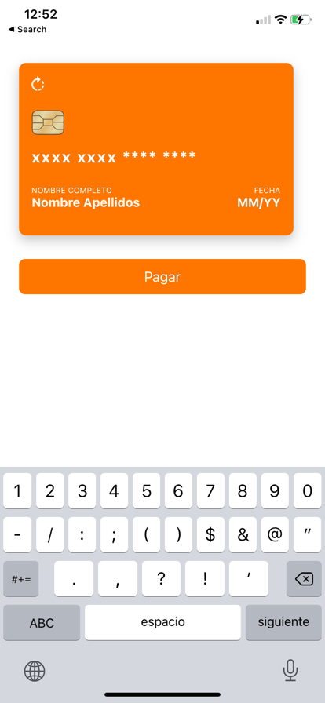

# openpay-react-native

Openpay




## Installation

```sh
npm install openpay-react-native
```

## Usage

You can use our default form or you can use a custom form

```js
import OpenpayReactNative from "openpay-react-native";

// ...

<Openpay
  isProductionMode={false}
  merchantId="merchantId"
  publicKey="publicKey"
  //address={address} //optional
  successToken={successToken}
  failToken={failToken}
  loading={loading}
  deviceSession={deviceSession}
  buttonText="Pagar"
  custom={false}
/>

*Yo can see the example project
```

###Custom labes and place holders

```ts
<Openpay
                        isProductionMode={false}
                        merchantId="m2tmftuv5jao96rrezj2"
                        publicKey="pk_d5e9bff37db4468da3f80148bb94f263"
                        //address={address} //optional
                        successToken={successToken}
                        failToken={failToken}
                        loading={loading}
                        deviceSession={deviceSession}
                        buttonText="Pagar"
                        custom={false}
                        labels={
                            {
                                holder: 'Nombre completo',
                                expiration: 'FECHA'
                            }
                        }
                        placeholders={{
                            holder: "Nombre Apellidos",
                            number: 'xxxx xxxx **** ****',
                            expiration: 'MM/YY',
                            cvv: 'CVV'
                        }}
                    />
```

### Device session id
With the inicilization of de component you have to pass a callback that will be called with the deviceSession

```js
const deviceSession = (response) => {
    console.log('deviceSession');
    console.log(response);
  };
```

### Custom form
With the inicialization of the component you have to pass custom to true: custom={true}. With this, the form just call the device
session callback and let you tokenize the card manually with the exported function:

```ts
import {Openpay,createTokenWithCard} from 'openpay-react-native';
```

```ts
createTokenWithCard(
  {
    holder_name: 'Nombre Prueba',
    cvv2: '111',
    expiration_month: '12',
    card_number: '424242424242424242',
    expiration_year: '25',
    isProductionMode: false,
    merchantId: 'merchantId',
    publicKey: 'publicKey',
  }
).then((response) => {
  console.log(response);
});
```


##Full example
```ts
import * as React from 'react';
import { useEffect } from 'react';
import {
  Alert,
  SafeAreaView,
  ScrollView,
  StatusBar,
  StyleSheet,
  View,
} from 'react-native';
import Openpay from 'openpay-react-native';

export default function App() {
  const successToken = (response) => {
    console.log(response);
    Alert.alert('Tokne generado', response.id, [
      { text: 'OK', onPress: () => console.log('OK Pressed') },
    ]);
  };
  const failToken = (response) => {
    console.log(failToken);
    console.log(response);
    Alert.alert('Datos inválidos', [
      { text: 'OK', onPress: () => console.log('OK Pressed') },
    ]);
  };

  const deviceSession = (response) => {
    console.log('deviceSession');
    console.log(response);
  };
  
  return (
    <SafeAreaView>
      <StatusBar barStyle={'light-content'} />
      <ScrollView
        style={styles.scrollView}
        contentInsetAdjustmentBehavior="automatic">
        <View style={styles.sectionContainer}>
          <Openpay
            isProductionMode={false}
            merchantId="merchantId"
            publicKey="publicKey"
            //address={address} //optional
            successToken={successToken}
            failToken={failToken}
            deviceSession={deviceSession}
            buttonText="Pagar"
            custom={false}
          />
        </View>
      </ScrollView>
    </SafeAreaView>
  );
}

const styles = StyleSheet.create({
  sectionContainer: {
    marginTop: 32,
    paddingHorizontal: 24,
  },
  scrollView: {
  },
});

```

## Contributing

See the [contributing guide](CONTRIBUTING.md) to learn how to contribute to the repository and the development workflow.

## License

MIT
